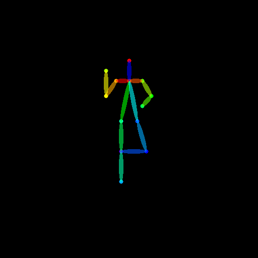

# gptpose

GPT-4 conditioning Stable Diffusion through automatic pose image generations based on body pose descriptions.

> DISCLAIMER: This is currently in development and only available using GPT-4 API, GPT-3 is not good for the task. Be careful about API consumption. 

## How it works

Input a body description like: 

> "A person sitting in a chair with his left hand up, and the right hand over his leap. His head is straight and has a crossed leg over the other."

And get the pose image proposed by GPT-4: 

You can then use that pose image reference along with [ControlNet](https://github.com/lllyasviel/ControlNet) in Stable Diffusion to generate conditioned pictures.

This is useful when you want to ilustrate a story and you don't know it before hand, therefore the character's posture is also unknown, so you can ask ChatGPT to imagine it, input the body pose description to `gptpose` and get the corresponding pose image template, allowing you to have and end-to-end AI powered workflow for image generation instead of having to know a story beforehand and manually pre-define pose references/templates. 

## Installation 

Run the following command:

> conda env create -f environment.yaml

Which will create a cona env called `gptpose-dev`

## Usage 

Run the following command: 

> gptpose -d "[body_pose_description]" -o "[output_path]/[filename].png"